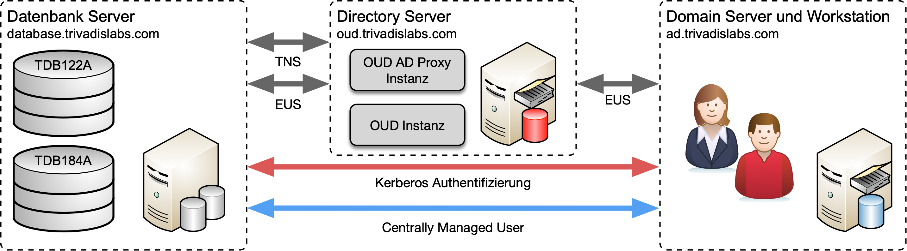

# Einleitung DOAG Schulungstag 2018

Im Rahmen des Workshop besteht die Gelegenheit verschiedene Themen am praktischen Beispiel zu vertiefen. Dazu gibt es zu jedem Kaptiel Aufgaben, welche nach Anleitung oder individuell auf einer Testumgebung umgesetzt werden können. Die Testumgebung besteht, wie man in der folgenden Abbildung sehen kann, jeweils aus drei virtuellen Systemen. Pro zweier Team steht jeweils eine entsprechende Testumgebung zur Verfügung. 

Eine Umgebung besteht jeweils aus 3 VM’s
* DB Server mit Oracle 12.2 und 18c
* OUD Server mit OUD 12.1.2.3
* Windows Server 2012 R2 mit MS Active Directory


*Abb. 1: Architektur Schulungsumgebung*

Für die Zeitdauer des DOAG Schulungstages wurden diese Testumgebungen in der Oracle Ravello Cloud aufgebaut. Der Zugriff erfolgt direkt mit SSH (Linux VM's) oder Remote Desktop (Windows VM) vom eigenen Laptop. Zuweisung der Testumgebung erfolgt durch den Referenten.

Wichtigsten Login Informationen im Überblick:

* Datenbank Server (Linux VM)
    * **Host Name :** db.trivadislabs.com
    * **Interne IP Adresse :** 10.0.0.3
    * **Externe IP Adresse :** gemäss Liste 
* Directory Server (Linux VM)
    * **Host Name :** oud.trivadislabs.com
    * **Interne IP Adresse :** 10.0.0.5
    * **Externe IP Adresse :** gemäss Liste
* Active Directory Server (Windows VM)
    * **Host Name :** ad.trivadislabs.com
    * **Interne IP Adresse :** 10.0.0.4
    * **Externe IP Adresse :** gemäss Liste
* Benutzer und Passwörter
    * root / gemäss Referent oder SSH Key
    * oracle / gemäss Referent oder SSH Key
    * sys / manager
    * system / manager
    * TRIVADISLABS\\Administrator / gemäss Referent
    * Allgemein AD User ist Nachname/LAB01schulung

Im Kapitel [Demo und Übungsumgebung](#demo--und-workshopumgebung) wird die Testumgebung etwas ausführlicher beschrieben. Zusätzlich besteht die Möglichkeit, selber eine eingene Testumgebung aufzubauen. Hierzu gibt es ein GitHub Repository [oehrlis/trivadislabs.com](https://github.com/oehrlis/trivadislabs.com) mit entsprechender Dokumentation, Scripts, Vagrant Files etc. um die Trivadis LAB Umgebung basierend auf Oracle [Virtualbox](https://www.virtualbox.org/wiki/Downloads) und [vagrant](https://www.vagrantup.com) nahezu vollautomatisch lokal aufzubauen.

# Übungen: Datenbank Authentifizierung und Password Verifier

**Übungsziele:** Kennenlernen der Übungsumgebung, BasEnv sowie der Datenbanken. Festigen der Kenntnisse im Bereich Passwort Authentifizierung und Password Hashes.

Arbeitsumgebung für die Übung
* **Server:** db.trivadislabs.com
* **DB:** TDB122A oder TDB184A

Die folgenden Aufgaben und Beispiele werden auf der DB TDB184A durchgeführt. Grundsätzlich können diese aber auch auf TDB122A ausgeführt werden.

## Überprüfung der aktuellen Password Verifier

1. Prüfen was aktuell für Passwort Hashes in der Datenbank vorhanden sind. Welche Hashes gibt es? Wieso sind bei gewissen Benutzer keine Angaben in *password_versions*?

```SQL
set linesize 120 pagesize 200
col USERNAME for a25
SELECT username, password_versions FROM dba_users;
```

2. Prüfen wie die VIEW *dba_users* auf die Information zu *password_versions* kommt. Im Code zum View *dba_users* findet man entsprechende *decode* Funktionen wo auf die Spalten *u.password* und *u.spare4* zugegriffen wird.

```SQL
set linesize 120 pagesize 200
set long 200000
SELECT text FROM dba_views WHERE view_name='DBA_USERS';
```

3. Was für Passwort Hashes hat der Benutzer SCOTT effektiv?

```SQL
set linesize 120 pagesize 200
col password for a16
col spare4 for a40
SELECT password, spare4 FROM user$ WHERE name='SCOTT';
```

4. Kontrolle was in der Datei ``sqlnet.ora`` für die Parameter *ALLOWED_LOGON_VERSION_** definiert wurde. Verwenden sie alternative ``cat``, ``less``, ``more`` oder ``vi`` um den Inhalt von ``sqlnet.ora`` anzuzeigen.

```bash
less $cdn/admin/sqlnet.ora

cat $cdn/admin/sqlnet.ora|grep -i ALLOWED_LOGON_VERSION
```

5. Prüfen was von SQLNet effektive verwendet wird. 
* Einschalten des SQLNet Tracing auf der Client Seite. Setzen von *DIAG_ADR_ENABLED* und *TRACE_LEVEL_CLIENT*. Anbei manuell mit ``vi`` oder alternativ direkt mit ``sed`` ersetzten lassen.

```bash
vi $cdn/admin/sqlnet.ora
DIAG_ADR_ENABLED=OFF
TRACE_LEVEL_CLIENT=SUPPORT
```

```bash
sed -i "s|DIAG_ADR_ENABLED.*|DIAG_ADR_ENABLED=OFF|" $cdn/admin/sqlnet.ora
sed -i "s|TRACE_LEVEL_CLIENT.*|TRACE_LEVEL_CLIENT=SUPPORT|" $cdn/admin/sqlnet.ora
```

* Löschen allfälliger alten Trace files.

```bash
rm $cdn/trc/sqlnet_client_*.trc
```

* Verbinden als Benutzer Scott

```bash
sqlplus scott/tiger

show user
```

* Kontrolle des Trace Files. Was ist für ALLOWED_LOGON_VERSION gesetzt? Falls nichts gesetzt ist, was für ein Wert gilt?

```bash
ls -rtl $cdn/trc
less $cdn/trc/sqlnet_client_*.trc

grep -i ALLOWED_LOGON_VERSION $cdn/trc/sqlnet_client_*.trc
```

* Tracing wieder ausschalten.

```bash
vi $cdn/admin/sqlnet.ora
DIAG_ADR_ENABLED=ON
TRACE_LEVEL_CLIENT=OFF
```

```bash
sed -i "s|DIAG_ADR_ENABLED.*|DIAG_ADR_ENABLED=ON|" $cdn/admin/sqlnet.ora
sed -i "s|TRACE_LEVEL_CLIENT.*|TRACE_LEVEL_CLIENT=OFF|" $cdn/admin/sqlnet.ora
```

## Anpassen der Password Verifier

1. Löschen des Oracle 12c Password Hash vom Benutzer Scott. Respektive explizites setzen des 11g Hashes.

```SQL
SELECT spare4 FROM user$ WHERE name='SCOTT';

set linesize 170
col 11G_HASH for a62

SELECT 
    REGEXP_SUBSTR(spare4,'(S:[[:alnum:]]+)') "11G_HASH"
FROM user$ WHERE name='SCOTT';

col 12C_HASH for a162
SELECT 
    REGEXP_SUBSTR(spare4,'(T:[[:alnum:]]+)') "12C_HASH"
FROM user$ WHERE name='SCOTT';

ALTER USER scott IDENTIFIED BY VALUES 'S:54A0B23AE639D4E0E22963A65A380DD496B8FCB65D1A5F9CC910EE625D8C';
```

2. Kontrolle der *password_versions* vom Benutzer *SCOTT*.

```SQL
col username for a30
SELECT username,password_versions FROM dba_users WHERE username='SCOTT';
```

3. Anpassen des SQLNet Parameter *ALLOWED_LOGON_VERSION_SERVER* uns setzen des 12a Authentifizierungsprotokolls.

```bash
sed -i "s|#SQLNET.ALLOWED_LOGON_VERSION_SERVER.*|SQLNET.ALLOWED_LOGON_VERSION_SERVER=12a|" $cdn/admin/sqlnet.ora
sed -i "s|SQLNET.ALLOWED_LOGON_VERSION_SERVER.*|SQLNET.ALLOWED_LOGON_VERSION_SERVER=12a|" $cdn/admin/sqlnet.ora
```

4. Als User Scott verbinden. Kann man sich überhaupt verbinden?

```bash
sqlplus scott/tiger

show user
```

5. Anpassen des SQLNet Parameter *ALLOWED_LOGON_VERSION_CLIENT* uns setzen des 11 Authentifizierungsprotokolls.

```bash
sed -i "s|#ALLOWED_LOGON_VERSION_CLIENT.*|SQLNET.ALLOWED_LOGON_VERSION_CLIENT=11|" $cdn/admin/sqlnet.ora
sed -i "s|SQLNET.ALLOWED_LOGON_VERSION_CLIENT.*|SQLNET.ALLOWED_LOGON_VERSION_CLIENT=11|" $cdn/admin/sqlnet.ora
```

6. Als User Scott verbinden. Kann man sich überhaupt verbinden?

```bash
sqlplus scott/tiger

show user
```

7. Was passiert wenn man als *SYS* das Passwort von *SCOTT* neu setzt? Welcher Passwort Hash hat *SCOTT* nun?

```SQL
connect / as sysdba

ALTER USER scott IDENTIFIED BY tiger;

set linesize 120 pagesize 200
col USERNAME for a25
SELECT username, password_versions FROM dba_users WHERE username='SCOTT';
```

## Zusatz Aufgaben

Falls noch Zeit übrig ist, können Sie noch folgende Aufgaben lösen:

* Setzten von *ALLOWED_LOGON_VERSION_CLIENT* und *ALLOWED_LOGON_VERSION_SERVER* auf Werte kleiner 11 z.B 10, 9 oder 8. Was bekommt der Benutzer *SCOTT* für Passwort Hashes wenn man als *SYS* das Passwort mit *ALTER USER* neu setzt?
* Welches Passwort wird beim Login verwendet? Sie können das Prüfen indem sie ein

# Übungen: Kerberos Authentifizierung

**Übungsziele:** Konfiguration der Kerberos Authentifizierung für die Datenbanken TDB122A und TDB184. Erstellen eines Benutzers mit Kerberos Authentifizierung sowie erfolgreichem Login lokal (Linux VM) und remote (Windows VM).

## Service Principle und Keytab Datei

Arbeitsumgebung für die Übung
* **Server:** ad.trivadislabs.com
* **Benutzer:** Administrator

Für die Kerberos Authentifizierung wird ein Service Principle benötigt. Der Entsprechende Benutzer Account wurde vorbereitet. Konntrollieren Sie in auf dem Server *ad.trivadislabs.com* mit dem Tool *Active Directory User and Computers* ob der Benutzer *db.trivadislabs.com* existiert. Falls ja, was hat der Benutzer für Einstellungen bezüglich Login Name und Account optionen? Passen Sie ggf noch die Account Optionen an uns setzen *Kerberos AES 128* und *Kerberos AES 256*. Die folgende Abbildung zeigt ein Beispiel.


*Abb. 2: Benutzereigenschaften von dba.trivadislabs.com*

***Zusatzaufgabe*** Optional können Sie den Benutzer auch löschen und neu anlegen.

Erstellen Sie für diesen Benutzer eine Keytab Datei. Öffnen Sie dazu ein Command Prompt (``cmd.exe``).

```bash
ktpass.exe -princ oracle/db.trivadislabs.com@TRIVADISLABS.COM -mapuser db.trivadislabs.com -pass LAB01schulung -crypto ALL -ptype KRB5_NT_PRINCIPAL  -out C:\u00\app\oracle\network\db.trivadislabs.com.keytab
```

Kopieren Sie die Keytab Datei mit WinSCP auf den Datenbank Sever in das Verzeichnis ``$cdn/admin``. Achten Sie darauf, dass die Datei als Binärdatei kopiert wird.

Kontrolle der Keytab Datei mit ``oklist`` auf dem Datenbank Server. 

```bash
oklist -e -f $cdn/admin/db.trivadislabs.com.keytab
```

## SQLNet Konfiguration

Ergänzen Sie die ``sqlnet.ora`` Datei mit folgenden Parametern.

```bash
vi $cdn/admin/sqlnet.ora
##########################################################################
# Kerberos Configuration
##########################################################################
SQLNET.AUTHENTICATION_SERVICES = (BEQ,KERBEROS5)
SQLNET.FALLBACK_AUTHENTICATION = TRUE
SQLNET.KERBEROS5_KEYTAB = /u00/app/oracle/network/admin/db.trivadislabs.com.keytab
SQLNET.KERBEROS5_REALMS = /u00/app/oracle/network/admin/krb.realms
SQLNET.KERBEROS5_CC_NAME = /u00/app/oracle/network/admin/krbcache
SQLNET.KERBEROS5_CONF = /u00/app/oracle/network/admin/krb5.conf
SQLNET.KERBEROS5_CONF_MIT=TRUE
SQLNET.AUTHENTICATION_KERBEROS5_SERVICE = oracle
```

Erstellen Sie die Kerberos Konfigurationsdatei ``krb5.conf`` mit folgendem Inhalt.

```bash
[libdefaults]
 default_realm = TRIVADISLABS.COM
 clockskew=300
 ticket_lifetime = 24h
 renew_lifetime = 7d
 forwardable = true

[realms]
 TRIVADISLABS.COM = {
   kdc = ad.trivadislabs.com
   admin_server = ad.trivadislabs.com
}

[domain_realm]
.trivadislabs.com = TRIVADISLABS.COM
trivadislabs.com = TRIVADISLABS.COM
```

Kontrollieren Sie ob die Namensauflösung wie gewünscht funktioniert.

```bash
nslookup ad.trivadislabs.com
nslookup 10.0.0.4
nslookup db.trivadislabs.com
nslookup 10.0.0.5

```


## Kerberos Authentifizierung


## Zusatz Aufgaben


- Einrichten keytab file
- DB user erstellen
- okinit auf db server
- kerkberos login auf DB server
- User informationen
- kerberos login remote vom AD domain
- bestehendne benutzer anpassen
- Kerberos mit Proxy kombinieren

Kurs Agenda
Einleitung
DB Authentifizierung und Password Verifier
Einführung Übungsumgebung
- wie ist die Umgebung aufgebaut (Architektur, Software, Zugriff)
- TRIVADISLAB Domain
- Firma Born Inc.
- passwörter
- Zugriff via ssh / putty
- Zugriff via Remote Desktop
- Trivadis Basenv und OUD Base
Übungen Password Verifier
Kerberos Authentifizierung
Übungen Kerberos Authentifizierung

User anlegen

krb5 file auf dem server anlegen
####krb5.conf DB Server


sqlnet.ora file

```bash
##########################################################################
# Kerberos Configuration
##########################################################################
SQLNET.AUTHENTICATION_SERVICES = (BEQ,KERBEROS5)
SQLNET.FALLBACK_AUTHENTICATION = TRUE
SQLNET.KERBEROS5_KEYTAB = /u00/app/oracle/network/admin/db.trivadislabs.com.keytab
SQLNET.KERBEROS5_REALMS = /u00/app/oracle/network/admin/krb.realms
SQLNET.KERBEROS5_CC_NAME = /u00/app/oracle/network/admin/krbcache
SQLNET.KERBEROS5_CONF = /u00/app/oracle/network/admin/krb5.conf
SQLNET.KERBEROS5_CONF_MIT=TRUE
SQLNET.AUTHENTICATION_KERBEROS5_SERVICE = oracle

```

Create the keytab file

```batch
ktpass.exe -princ oracle/db.trivadislabs.com@TRIVADISLABS.COM \
    -mapuser db.trivadislabs.com -pass manager \
    -crypto ALL -ptype KRB5_NT_PRINCIPAL \
    -out C:\u00\app\oracle\network\db.trivadislabs.com.keytab
```

```bash
ktpass.exe -princ oracle/db.trivadislabs.com@TRIVADISLABS.COM -mapuser db.trivadislabs.com -pass manager -crypto ALL -ptype KRB5_NT_PRINCIPAL  -out C:\u00\app\oracle\network\db.trivadislabs.com.keytab
```

Kaffeepause Vormittag
Kerberos Troubleshooting
- was gibts so für Probleme
    - Namesauflösung und DNS Probleme
    - Zeit Differenzen
    - Keytab File falsch z.B. falscher Algorithmus, vno Nummer etc
    - 
- welche Möglichkeiten für die Problemanalyse stehen zur Verfügung
- SQLNet Trace
- Wireshark
- TRACE File

# Übungen: Centrally Managed User 18c

Generell verschiedenens

## Übung Centrally Managed User 18c

Was neues in 18c

# Übungen: Oracle Unified Directory


## Einführung in Oracle Unified Directory

OUD ist super


## OUD Directroy Server und AD Proxy

gibt beides DS und Proxy


## Oracle Unified Directory, Hochverfügbarkeit und Backup & Recovery

halt wichtig

# Übungen: Oracle Enterprise User Security

Allgemein

## Übungen Oracle Enterprise User Security Teil 1

Kaffeepause Nachmittag

## Übungen Oracle Enterprise User Security Teil 2

Oracle Unified Directory, Hochverfügbarkeit und Backup & Recovery

## Troubleshooting Enterprise User Security

fehler gibt es immer

# Zusammenfassung und Abschluss

Das war's mit Tricks und Gägs, tschouzäme