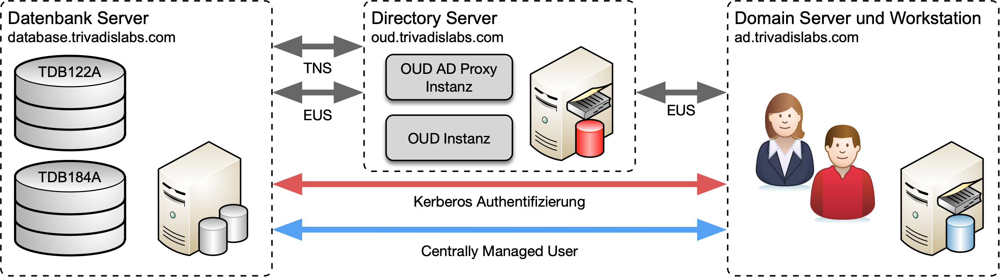

# Demo und Übungsumgebung

## Architektur

Für die praktischen Arbeiten im Rahmen des DOAG 2018 Schulungstages, steht pro zweiter Team eine einfach Testumgebung zur Verfügung. Die Umgebung läuft für die Dauer der Schulung in der [Oracle Ravello Cloud](https://cloud.oracle.com/en_US/ravello) und besteht, wie in Abbildung 1 ersichtlich aus folgenden Servern respektive VMs:

* **db.trivadislabs.com** Oracle Datenbank Server mit Oracle 12c R2 sowie 18c
* **oud.trivadislabs.com** Oracle Directory Server mit Oracle Unified Directory 12c
* **ad.trivadislabs.com** MS Windows Server 2012 R2 mit Active Directory


*Abb. 1: Architektur Schulungsumgebung*

Die Umgebung ist soweit vorbereitet, dass direkt mit den Übungen gestartet werden kann. 

Die zentrale Benutzerverwaltung mit _Oracle Centrally Managed Users_ oder _Oracle Enterprise User Security_ sind komplexe Themen, welche nicht abschliessend am Schulungstag diskutiert werden können. Aus diesem Grund gibt es für das Selbststudium die Möglichkeit, eine Testumgebung analog dem Schulungstag aufzubauen. Diese Umgebung wird Skript gestützt mit [Vagrant](https://www.vagrantup.com) auf [Virtualbox](https://www.virtualbox.org/wiki/Downloads) aufgebaut. Man benötigt lediglich die entsprechenden Software Images für die Oracle Datenbank 12c R2 + 18c, Oracle Unified Directory sowie die Umgebungsscripte. Anschliessend lässt sich die Umgebung nahezu voll automatisch aufbauen. Eine entsprechende Anleitung für den Aufbau der Trivadis LAB Umgebung sowie die dazugehörigen _Vagrant Files_, _Skripte_ etc. findet man im GitHub Repository [oehrlis/trivadislabs.com](https://github.com/oehrlis/trivadislabs.com).

## Oracle Datenbank Server

### Generelle Server Konfiguration

Der Oracle Datenbank Server ist wie folgt konfiguriert:

* **Betriebssystem :** Oracle Enterprise Linux Server Release 7.5
* **Oracle Datenbank Software :**
    * Oracle 12c Release 2 Enterprise Edition (12.2.0.1) mit Release Update vom Oktober 2018
    * Oracle 18c Enterprise Edition (18.4.0.0) mit Release Update vom Oktober 2018
* **Oracle Datenbanken :**
    * **TDB122A** Oracle 12cR2 Enterprise Edition Single Instance für die Übungen mit EUS
    * **TDB184A** Oracle 18c Enterprise Edition Single Instance für die Übungen mit CMU
* **Betriebsystem Benutzer :** 
    * oracle / TW4,36BAK3
    * root / 27.2VNCN4z
* **Datenbank Benutzer :** 
    * sys / manager
    * system / manager
    * scott / tiger
    * tvd_hr / tvd_hr

### Trivadis BasEnv

Das Trivadis Base Environment (TVD-BasenvTM) ermöglicht einfaches Navigieren in der Directory Struktur und zwischen den verschiedenen Datenbanken. In der folgenden Tabelle sind die Aliases für den OS Benutzer *oracle* aufgelistet, welche am häufigsten verwendet werden.

| Alias Name | Beschreibung                                                              |
|------------|---------------------------------------------------------------------------|
| TDB122A    | setzt die Umgebung im Terminal für die Datenbank TDB122A                  |
| TDB184A    | setzt die Umgebung im Terminal für die Datenbank TDB184A                  |
| cda        | zum Admin Verzeichnis der aktuell gesetzten Datenbank                     |
| cdob       | zum Oracle Base                                                           |
| cdh        | zum Oracle Home                                                           |
| cdt        | zum TNS_ADMIN                                                             |
| sqh        | startet SQLPlus mit „sqlplus / as sysdba“ inklusive Befehlshistory        |
| u          | Statusanzeige für alle Oracle Datenbanken und Listener (z.B. open, mount) |
| sta        | Statusanzeige für die aktuell gesetzte Datenbank                          |
| via        | öffnet das Alertlog der aktuell gesetzten Datenbank in vi                 |
| taa        | öffnet das Alertlog der aktuell gesetzten Datenbank mit ``tail -f``       |

Die Installation ist nach dem OFA (Optimal Flexible Architecture) Standard vorgenommen worden – Beispiel für die Installation auf der Datenbank-VM für die Datenbank - TDB122A:

| Mount Point / Directory                  | Beschreibung                             |
|------------------------------------------|------------------------------------------|
| ``/u00/app/oracle/admin/TDB122A/adump``  | Oracle Audit Files                       |
| ``/u00/app/oracle/admin/TDB122A/backup`` | Oracle Backup                            |
| ``/u00/app/oracle/admin/TDB122A/dpdump`` | Data Pump Dateien                        |
| ``/u00/app/oracle/admin/TDB122A/etc``    | Oracle Backup Konfig Dateien             |
| ``/u00/app/oracle/admin/TDB122A/log``    | Log Dateien (z.B. Backup, Export, etc.)  |
| ``/u00/app/oracle/admin/TDB122A/pfile``  | Parameter- und Password-Datei            |
| ``/u00/app/oracle/admin/TDB122A/wallet`` | Oracle Wallet                            |
| ``/u00/app/oracle/etc``                  | oratab und diverse Konfigurationsdateien |
| ``/u00/app/oracle/local/dba``            | Environment Tools (TVD-Basenv)           |
| ``/u00/app/oracle/network/admin``        | Oracle Net Konfigurationsdateien         |
| ``/u00/app/oracle/product/12.2.0.1``     | Oracle 12.2.0.1 Home                     |
| ``/u00/app/oracle/product/18.4.0.0 ``    | Oracle 18.4.0.0 Home                     |
| ``/u01/oradata/TDB122A``                 | Datenbank Dateien, Redo Log Files, CTL   |
| ``/u02/oradata/TDB122A``                 | Redo Log Files, CTL                      |
| ``/u02/fast_recovery_area/TDB122A``      | Fast Recovery Area                       |

### Übungschema TVD_HR

In den Datenbanken ist neben dem Scott Demo Schema zusätzlich das Beispiel Schema *TVD_HR*. Das Schema *TVD_HR* basiert auf dem bekannten Oracle *HR* Beispiel Schema. Der wesentliche Unterschied zum regulären *HR* Schema ist, dass die Abteilungen sowie Mitarbeiter den Mitarbeitern im Active Directory entspricht.

Erklärung zu den Tabellen basierend auf den Kommentaren vom *HR* Schema:

* **REGIONS** Tablle, welche Regionsnummern und -namen enthält. Verweise auf die Tabelle *LOCATION*.
* **LOCATIONS** Tablle, die die spezifische Adresse eines bestimmten Büros, Lagers und/oder Produktionsstandortes eines Unternehmens enthält. Speichert keine Adressen von Kundenstandorten.
* **DEPARTMENTS** Tabelle, die Details zu den Abteilungen zeigt, in denen die Mitarbeiter arbeiten. Verweise auf Standorte, Mitarbeiter und Job History Tabellen.
* **JOB_HISTORY** Tabelle, in der die Beschäftigungshistorie der Mitarbeiter gespeichert ist. Wenn ein Mitarbeiter innerhalb der Stelle die Abteilung wechselt oder die Stelle innerhalb der Abteilung wechselt, werden neue Zeilen in diese Tabelle mit alten Stelleninformationen des Mitarbeiters eingefügt. Verweise auf Tabellen mit Jobs, Mitarbeitern und Abteilungen.
* **COUNTRIES** Tabelle. Verweise mit der Tabelle der Standorte.
* **JOBS** Tabelle mit Jobbezeichnungen und Gehaltsgruppen. Verweise auf Mitarbeiter und Job History Tabelle.
* **EMPLOYEES** Tabelle. Verweise mit Abteilungen, Jobs, Job History Tabellen. Enthält eine Selbstreferenz.

Zukünftige Versionen von TVD_HR werden zusätzlich entsprechend VPD Policies enthalten.

## Oracle Unified Directory Server

### Generelle Server Konfiguration

Der Directory Server ist wie folgt konfiguriert:

* **Betriebssystem :** Oracle Enterprise Linux Server Release 7.5
* **Java :** Oracle JAVA Server JRE 1.8 u192
* **Oracle Fusion Middleware Software :**
    * Oracle Unified Directory (12.2.1.3) mit dem Bundle Patch vom Oktober 2018
    * Oracle Fusion Middleware Infrastructure Directory (12.2.1.3) mit dem Bundle Patch vom Oktober 2018
* **Oracle Home oud12.2.1.3 :** Oracle Unified Directory standalone Installation.
* **Oracle Home fmw12.2.1.3 :** Oracle Unified Directory collocated Installation mit Fusion Middleware Infrastructure.
* **Betriebsystem Benutzer :** 
    * oracle / TW4,36BAK3
    * root / 27.2VNCN4z
  
### Trivadis OUD Base

Wie wo was ist basenv

## MS Active Directory Server

### Generelle Server Konfiguration

AD VM ist hier

```
TRIVADISLABS\Administrator
: qp8F+82Pe9
```

### AD Domain TRIVADISLAB

Die Domain


\pageref*